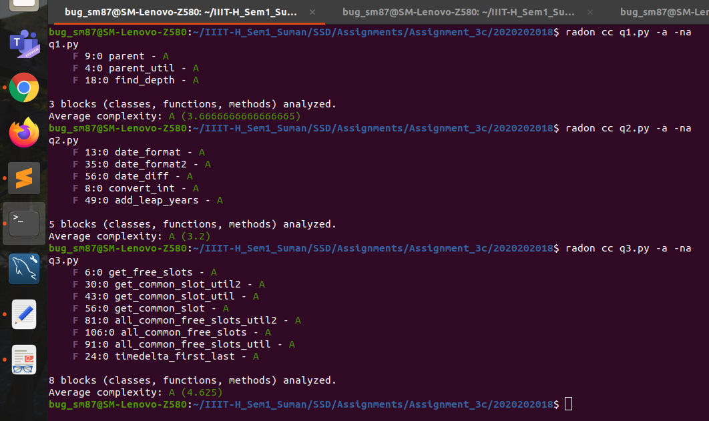

# SSD ASSIGNMENT - 3 (Part C)
- A new branch of the same **Github Repo** is used: https://github.com/SumanM-IIIT/SSD-Assignment-3-Part-A-/tree/branch_3c
- Screenshot for Cyclomatic Complexity Checking of all the questions: 

### CHANGES w.r.t previous Assignment (3B):
- **Q1:**
    - Splitted the **parent()** function into two smaller functions: **parent()** and **parent_util()**. **(Lines: 4 to 16)**
- **Q2:**
    - Created a function **convert_int()** that performs a task which was redundant in the **date_format()** and **date_format2()** functions previously. **(Lines: 8 to 11)**
- **Q3:**
   - Splitted the function **all_common_free_slots()** into three smaller functions: **all_common_free_slots()**, **all_common_free_slots_util()** and **all_common_free_slots_util2()**. **(Lines: 81 to 128)**
   - Splitted the function **get_common_slot()** into three smaller functions: **get_common_slot()**, **get_common_slot_util()** and **get_common_slot_util2()**. **(Lines: 30 to 79)**
   - Created a function **timedelta_first_last()** to perform a task which was previously a part of **get_common_slot_util2()** function. **(Lines: 24 to 28)**